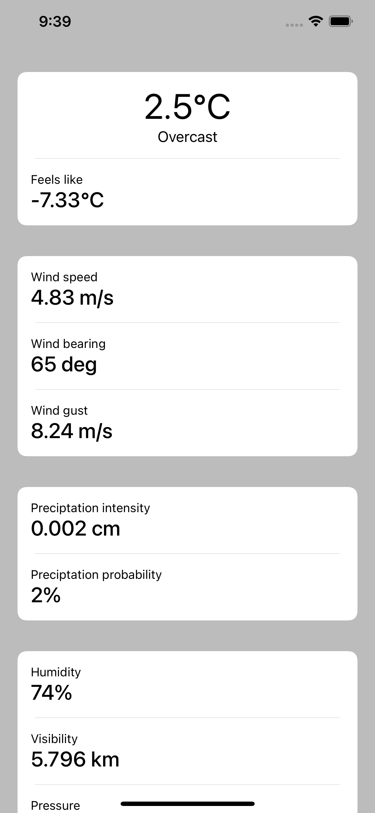

# WeatherApp

Hello there! WeatherApp is a simple app that fetches and displays the weather for your current location. If you don't want to share your location, it uses [Yakutsk](https://www.nationalgeographic.com/magazine/2018/02/explore-yakutsk-russia-coldest-city/) as the default location.

# Architecture
The app contains one module, the module is UIViewController decomposed into small components. Each module contains:
- **DisplayLogic** displays data
- **Interactor** performs business logic
- **Repository** provides data to business logic. Uses Combine to orchestrate with the service layer
- **Presenter** maps data to a human-readable format
- **Router** routes to other modules or open some links

There is a service layer below the repository component
- **WeatherApi** provides data according to contract
- **LocationProvider** provides current device location

Here is a [class diagram](Weather.pdf)
